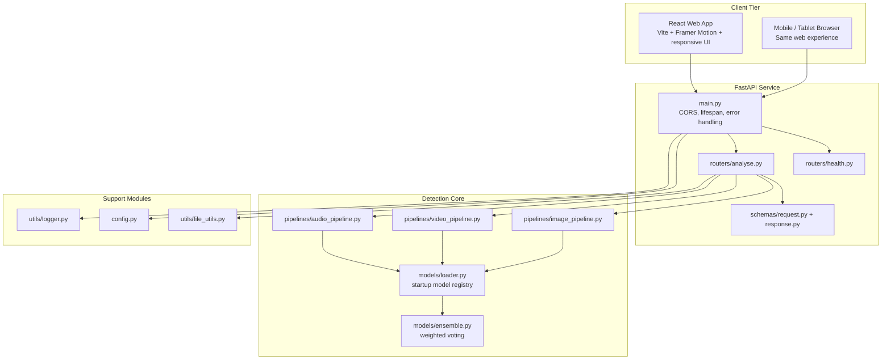
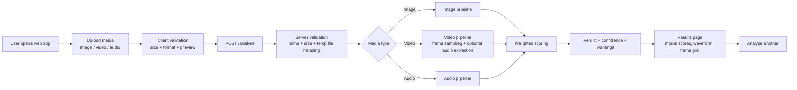

<!--
Internal trace:
- Wrong before: the README used a single giant bootstrap command, which was harder to trust, debug, and maintain for real users.
- Fixed now: the README keeps the professional overview but switches startup guidance to structured multi-step commands for Docker and manual local development.
-->

<<<<<<< HEAD
# KAVACH-AI
=======
# Multimodal Deepfake Detection System Using Advanced Machine Learning Techniques
>>>>>>> 7df14d1 (UI enhanced)

<p align="center">
  <strong>DeepShield AI for upload-first deepfake detection</strong><br />
  A responsive web application for analysing image, video, and audio authenticity with a FastAPI backend and a modern React frontend.
</p>

<p align="center">
<<<<<<< HEAD
  
=======
  
>>>>>>> 7df14d1 (UI enhanced)
</p>

<p align="center">
  
  
  
  
</p>

---

## Project Understanding

<<<<<<< HEAD
KAVACH-AI is a **web-first deepfake detection platform** built around one reliable user journey: **upload, analyse, review, repeat**.
=======
Multimodal Deepfake Detection System Using Advanced Machine Learning Techniques is a **web-first deepfake detection platform** built around one reliable user journey: **upload, analyse, review, repeat**.
>>>>>>> 7df14d1 (UI enhanced)

The repository was cleaned and reorganized so the active application is easy to understand:

- `backend/` contains the FastAPI service, validation, model loading, and image/audio/video pipelines.
- `frontend/` contains the responsive React application for upload, progress tracking, and result review.
- `legacy/` contains archived experiments and older realtime/dashboard code that are no longer part of the running product.

### What the active application does

- Accepts **image**, **video**, and **audio** uploads.
- Validates file type and file size before analysis.
- Runs a weighted deepfake scoring pipeline.
- Returns a readable result with verdict, confidence, model breakdown, warnings, waveform data, and sampled video frames when available.
- Works as a **fully web application**. The Chrome extension path has been removed.

---

## Architecture Diagram



---

## Workflow Diagram



---

## Active Repository Layout

```text
.
+-- backend/
¦   +-- main.py
¦   +-- config.py
¦   +-- routers/
¦   +-- models/
¦   +-- pipelines/
¦   +-- schemas/
¦   +-- utils/
¦   +-- requirements.txt
¦   +-- Dockerfile
+-- frontend/
¦   +-- src/
¦   ¦   +-- api/
¦   ¦   +-- components/
¦   ¦   +-- hooks/
¦   ¦   +-- pages/
¦   ¦   +-- styles/
¦   +-- package.json
¦   +-- Dockerfile
+-- docs/
¦   +-- API.md
¦   +-- INSTALL.md
¦   +-- CODEBASE_DIAGRAM.md
¦   +-- assets/banner.png
+-- legacy/
¦   +-- backend/
¦   +-- frontend/
¦   +-- root-docs/
¦   +-- scripts/
+-- docker-compose.yml
```

---

## Tech Stack

### Backend

- FastAPI
- Pydantic Settings
- Transformers
- Torch / Torchvision / timm
- OpenCV
- librosa / soundfile / scipy

### Frontend

- React
- Vite
- Framer Motion
- Tailwind CSS
- Axios
- Lucide Icons

### Runtime Strategy

- Primary startup path: **Docker Compose**
- Fallback path: **Python venv + npm**
- Environment bootstrapping via `.env.example` files

---

## Recommended Setup

### Option A: Docker Compose

This is the fastest and most reliable way to run the project on a fresh system.

#### 1. Clone the repository

```bash
<<<<<<< HEAD
git clone https://github.com/abisheik687/kavach-ai.git
cd kavach-ai
=======
git clone https://github.com/abisheik687/Multimodal Deepfake Detection System Using Advanced Machine Learning Techniques.git
cd Multimodal Deepfake Detection System Using Advanced Machine Learning Techniques
>>>>>>> 7df14d1 (UI enhanced)
```

#### 2. Create environment files

```bash
cp .env.example .env
cp backend/.env.example backend/.env
cp frontend/.env.example frontend/.env
```

Windows PowerShell alternative:

```powershell
Copy-Item .env.example .env
Copy-Item backend\.env.example backend\.env
Copy-Item frontend\.env.example frontend\.env
```

#### 3. Start the full stack

```bash
docker compose up --build
```

#### 4. Open the application

- Web App: `http://localhost:4173`
- Backend API: `http://localhost:8000`
- API Docs: `http://localhost:8000/docs`

---

## Manual Local Development

Use this if you do not want Docker.

### 1. Install prerequisites

- Python 3.11+
- Node.js 20+
- npm
- ffmpeg

### 2. Clone the repository

```bash
<<<<<<< HEAD
git clone https://github.com/abisheik687/kavach-ai.git
cd kavach-ai
=======
git clone https://github.com/abisheik687/Multimodal Deepfake Detection System Using Advanced Machine Learning Techniques.git
cd Multimodal Deepfake Detection System Using Advanced Machine Learning Techniques
>>>>>>> 7df14d1 (UI enhanced)
```

### 3. Create environment files

```bash
cp .env.example .env
cp backend/.env.example backend/.env
cp frontend/.env.example frontend/.env
```

Windows PowerShell alternative:

```powershell
Copy-Item .env.example .env
Copy-Item backend\.env.example backend\.env
Copy-Item frontend\.env.example frontend\.env
```

### 4. Create and activate a Python virtual environment

```bash
python -m venv .venv
```

Windows PowerShell:

```powershell
.\.venv\Scripts\Activate.ps1
```

macOS / Linux:

```bash
source .venv/bin/activate
```

### 5. Install backend dependencies

```bash
pip install --upgrade pip
pip install -r backend/requirements.txt
```

### 6. Install frontend dependencies

This repository currently ships with `frontend/package-lock.json`, so `npm ci` is the correct fast and deterministic install method.

```bash
npm ci --prefix frontend
```

### 7. Start the backend

```bash
cd backend
uvicorn main:app --reload
```

### 8. Start the frontend in a second terminal

```bash
cd frontend
npm run dev
```

### 9. Open the application

- Web App: `http://localhost:4173`
- Backend API: `http://localhost:8000`
- API Docs: `http://localhost:8000/docs`

---

## Localhost Endpoints

- Web App: `http://localhost:4173`
- Backend API: `http://localhost:8000`
- API Docs: `http://localhost:8000/docs`
- Health Check: `http://localhost:8000/health`

---

## Environment Files

The repository ships with these active templates:

- Root: `.env.example`
- Backend: `backend/.env.example`
- Frontend: `frontend/.env.example`

These defaults are already tuned for the active upload-first application.

---

## Notes for Contributors

- The **Chrome extension has been removed** from the active product path.
- The older realtime and experimental surfaces are preserved under `legacy/` for reference only.
- If Hugging Face model downloads are unavailable, the backend still runs using deterministic fallback scorers instead of fake placeholder outputs.
- Video audio extraction requires `ffmpeg`; the Docker backend image installs it automatically.

---

## Documentation

- [Installation Guide](./docs/INSTALL.md)
- [API Overview](./docs/API.md)
- [Architecture Diagram](./docs/CODEBASE_DIAGRAM.md)
- [Compliance Notes](./docs/COMPLIANCE.md)
- [Legacy Archive Notes](./legacy/README.md)
