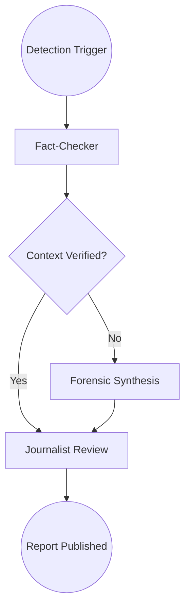

# 🕵️ Autonomous AI Agency — Technical Specification

## 1. Tactical Overview
<<<<<<< HEAD
The **KAVACH-AI Agency** is an autonomous intelligence layer designed to abstract complex forensic data into actionable threat intelligence. Built using **LangGraph**, it enables a stateful, iterative reasoning process where specialized agents collaborate to "solve" a detection event.
=======
The **Multimodal Deepfake Detection System Using Advanced Machine Learning Techniques Agency** is an autonomous intelligence layer designed to abstract complex forensic data into actionable threat intelligence. Built using **LangGraph**, it enables a stateful, iterative reasoning process where specialized agents collaborate to "solve" a detection event.
>>>>>>> 7df14d1 (UI enhanced)

## 2. Agent Archetypes & Specialized Logic

### 🛡️ Fact-Checker Agent (The Contextual Guard)
- **Logic Engine**: Semantic Search + RAG.
- **Workflow**:
    1. Extracts media metadata (hashes, geolocation, timestamps).
    2. Queries the **Pinecone Global Threat Matrix**.
    3. Performs Word-to-Vector analysis to detect disinformation semantic signatures.
- **Resolution**: Assigns a "Contextual Integrity" score.

### 🔬 Forensic Analyst (The Evidence Custodian)
- **Logic Engine**: Statistical Signal Processing.
- **Workflow**:
    1. Aggregates probability weights from the **Hyper-Modal Ensemble**.
    2. Analyzes **SyncNet** temporal offsets and **Optical Flow** warps.
    3. Synthesizes a **Signed Forensic PDF** bundle with SHA-256 integrity checks.
- **Resolution**: Generates the official "Chain-of-Evidence" (CoE) record.

### 📝 AI Journalist (The Communication Bridge)
- **Logic Engine**: NLP / Token-weighted Summary Generation.
- **Workflow**:
    1. Interprets agent findings and ensemble certainty.
    2. Simplifies technical jargon into human-readable alerts.
    3. Tailors output for different audiences (Executive vs. Public).
- **Resolution**: Prepares the "Mission Briefing" summary for the UI.

---

## 3. The LangGraph Orchestration
<<<<<<< HEAD
KAVACH-AI uses a **Top-Down Directed Acyclic Graph (DAG)** to manage agent states.
=======
Multimodal Deepfake Detection System Using Advanced Machine Learning Techniques uses a **Top-Down Directed Acyclic Graph (DAG)** to manage agent states.
>>>>>>> 7df14d1 (UI enhanced)

## 4. Integration & Scaling
The Agency operates as a modular Python service within the KAVACH cluster. It is horizontally scalable via Kubernetes, allowing for simultaneous investigation of hundreds of media streams.

---

*Mission Control Status: **Operational** | Agent Version: **2.0.4***
