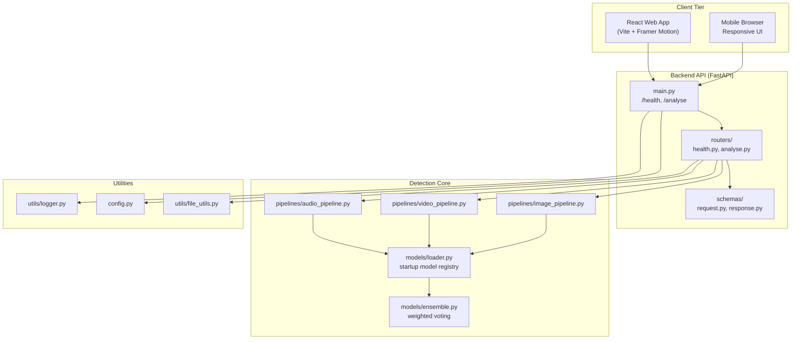

# Internal trace:
# - Wrong before: this diagram documented the retired browser extension, old API layout, and legacy orchestration stack that are no longer part of the active product path.
<<<<<<< HEAD
# - Fixed now: the diagram reflects the current web-only KAVACH-AI structure and the archived legacy boundary.

# KAVACH-AI / DeepShield Web Architecture
=======
# - Fixed now: the diagram reflects the current web-only Multimodal Deepfake Detection System Using Advanced Machine Learning Techniques structure and the archived legacy boundary.

# Multimodal Deepfake Detection System Using Advanced Machine Learning Techniques / DeepShield Web Architecture
>>>>>>> 7df14d1 (UI enhanced)

This diagram now reflects the active, web-only application structure.

---

## 1. High-Level System Architecture



---

## 2. Active Repo Structure

```text
.
+-- backend/
¦   +-- main.py
¦   +-- config.py
¦   +-- routers/
¦   +-- models/
¦   +-- pipelines/
¦   +-- schemas/
¦   +-- utils/
+-- frontend/
¦   +-- src/
¦   ¦   +-- api/
¦   ¦   +-- components/
¦   ¦   +-- hooks/
¦   ¦   +-- pages/
¦   ¦   +-- styles/
+-- legacy/
¦   +-- backend/
¦   +-- frontend/
¦   +-- root-docs/
¦   +-- scripts/
+-- docker-compose.yml
```

---

## 3. Notes

- The Chrome extension was removed from the active product path.
- Realtime/live analysis remains archived under `legacy/` and is not part of the running web application.
- The current product is intentionally centered on upload-and-analyse reliability across desktop, tablet, and mobile browsers.
