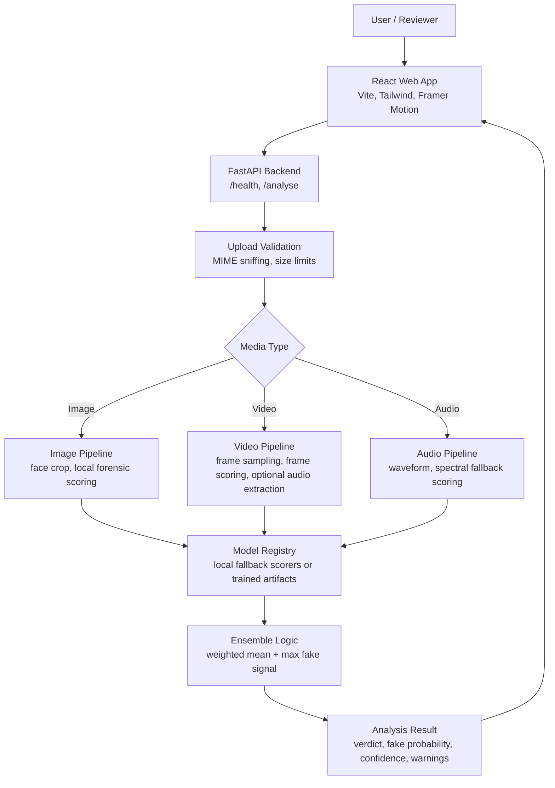
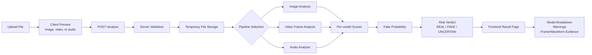
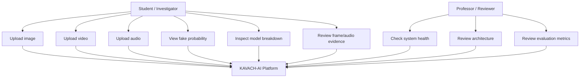
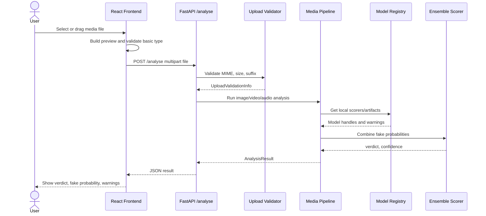
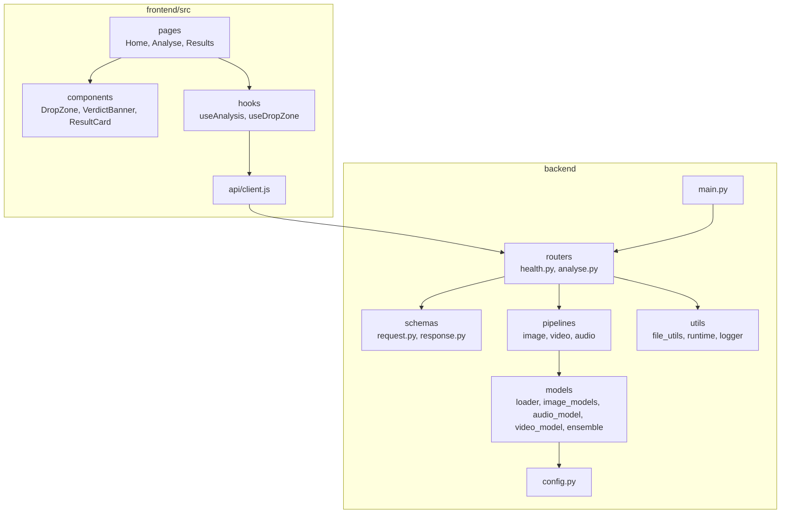
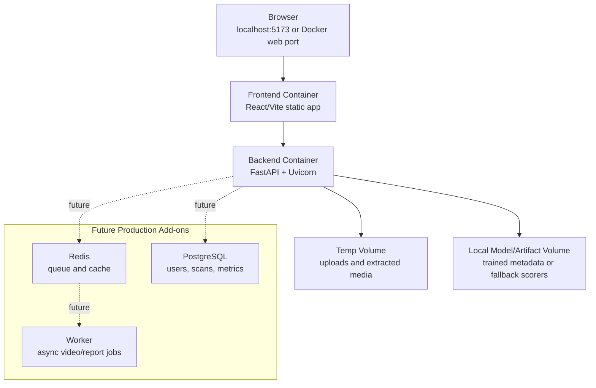
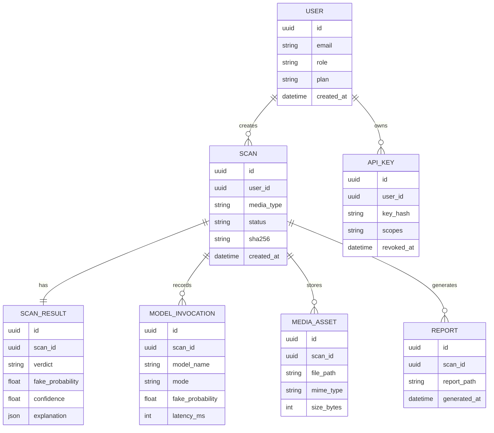

# KAVACH-AI System Diagrams

KAVACH-AI is an end-to-end AI forensic platform for probabilistic media authenticity analysis. It does not claim perfect deepfake detection. It combines upload validation, local forensic signals, model-style scoring, ensemble confidence logic, and explainable media evidence into one web workflow.

The current implementation is intentionally configured for free local inference only:

- `ENABLE_REMOTE_MODEL_DOWNLOADS=false`
- `HF_INFERENCE_MODE=local_only`
- `HF_WEEKLY_BUDGET_USD=0`
- `BLOCK_HF_CREDIT_USAGE=true`

This keeps the college demo independent of paid Hugging Face credits.

## 1. High-Level Architecture

```mermaid
flowchart TB
    User["User / Reviewer"] --> Web["React Web App\nVite, Tailwind, Framer Motion"]
    Web --> API["FastAPI Backend\n/health, /analyse"]

    API --> Validate["Upload Validation\nMIME sniffing, size limits"]
    Validate --> Router{"Media Type"}

    Router -->|Image| ImagePipe["Image Pipeline\nface crop, local forensic scoring"]
    Router -->|Video| VideoPipe["Video Pipeline\nframe sampling, frame scoring, optional audio extraction"]
    Router -->|Audio| AudioPipe["Audio Pipeline\nwaveform, spectral fallback scoring"]

    ImagePipe --> Registry["Model Registry\nlocal fallback scorers or trained artifacts"]
    VideoPipe --> Registry
    AudioPipe --> Registry

    Registry --> Ensemble["Ensemble Logic\nweighted mean + max fake signal"]
    Ensemble --> Result["Analysis Result\nverdict, fake probability, confidence, warnings"]
    Result --> Web
```

## 2. Data Flow Diagram

```mermaid
flowchart LR
    A["Upload File"] --> B["Client Preview\nimage, video, or audio"]
    B --> C["POST /analyse"]
    C --> D["Server Validation"]
    D --> E["Temporary File Storage"]
    E --> F{"Pipeline Selection"}
    F --> G["Image Analysis"]
    F --> H["Video Frame Analysis"]
    F --> I["Audio Analysis"]
    G --> J["Per-model Scores"]
    H --> J
    I --> J
    J --> K["Fake Probability"]
    K --> L["Risk Verdict\nREAL / FAKE / UNCERTAIN"]
    L --> M["Frontend Result Page"]
    M --> N["Model Breakdown\nWarnings\nFrame/Waveform Evidence"]
```

## 3. Use Case Diagram

```mermaid
flowchart TB
    Student["Student / Investigator"]
    Professor["Professor / Reviewer"]
    System["KAVACH-AI Platform"]

    Student --> U1["Upload image"]
    Student --> U2["Upload video"]
    Student --> U3["Upload audio"]
    Student --> U4["View fake probability"]
    Student --> U5["Inspect model breakdown"]
    Student --> U6["Review frame/audio evidence"]

    Professor --> U7["Check system health"]
    Professor --> U8["Review architecture"]
    Professor --> U9["Review evaluation metrics"]

    U1 --> System
    U2 --> System
    U3 --> System
    U4 --> System
    U5 --> System
    U6 --> System
    U7 --> System
    U8 --> System
    U9 --> System
```

## 4. Sequence Diagram

```mermaid
sequenceDiagram
    actor User
    participant UI as React Frontend
    participant API as FastAPI /analyse
    participant Validator as Upload Validator
    participant Pipeline as Media Pipeline
    participant Registry as Model Registry
    participant Ensemble as Ensemble Scorer

    User->>UI: Select or drag media file
    UI->>UI: Build preview and validate basic type
    UI->>API: POST /analyse multipart file
    API->>Validator: Validate MIME, size, suffix
    Validator-->>API: UploadValidationInfo
    API->>Pipeline: Run image/video/audio analysis
    Pipeline->>Registry: Get local scorers/artifacts
    Registry-->>Pipeline: Model handles and warnings
    Pipeline->>Ensemble: Combine fake probabilities
    Ensemble-->>Pipeline: verdict, confidence
    Pipeline-->>API: AnalysisResult
    API-->>UI: JSON result
    UI-->>User: Show verdict, fake probability, warnings
```

## 5. Component Diagram

```mermaid
flowchart TB
    subgraph Frontend["frontend/src"]
        Pages["pages\nHome, Analyse, Results"]
        Components["components\nDropZone, VerdictBanner, ResultCard"]
        Hooks["hooks\nuseAnalysis, useDropZone"]
        Client["api/client.js"]
    end

    subgraph Backend["backend"]
        Main["main.py"]
        Routes["routers\nhealth.py, analyse.py"]
        Schemas["schemas\nrequest.py, response.py"]
        Pipelines["pipelines\nimage, video, audio"]
        Models["models\nloader, image_models, audio_model, video_model, ensemble"]
        Utils["utils\nfile_utils, runtime, logger"]
        Config["config.py"]
    end

    Pages --> Components
    Pages --> Hooks
    Hooks --> Client
    Client --> Routes
    Main --> Routes
    Routes --> Schemas
    Routes --> Pipelines
    Pipelines --> Models
    Routes --> Utils
    Models --> Config
```

## 6. Deployment Diagram

```mermaid
flowchart TB
    Browser["Browser\nlocalhost:5173 or Docker web port"] --> Frontend["Frontend Container\nReact/Vite static app"]
    Frontend --> Backend["Backend Container\nFastAPI + Uvicorn"]
    Backend --> Temp["Temp Volume\nuploads and extracted media"]
    Backend --> Models["Local Model/Artifact Volume\ntrained metadata or fallback scorers"]

    subgraph OptionalFuture["Future Production Add-ons"]
        Redis["Redis\nqueue and cache"]
        Postgres["PostgreSQL\nusers, scans, metrics"]
        Worker["Worker\nasync video/report jobs"]
    end

    Backend -.future.-> Redis
    Backend -.future.-> Postgres
    Redis -.future.-> Worker
```

## 7. ER Diagram for Proposed Production Version

```mermaid
erDiagram
    USER ||--o{ SCAN : creates
    USER ||--o{ API_KEY : owns
    SCAN ||--|| SCAN_RESULT : has
    SCAN ||--o{ MODEL_INVOCATION : records
    SCAN ||--o{ MEDIA_ASSET : stores
    SCAN ||--o{ REPORT : generates

    USER {
        uuid id
        string email
        string role
        string plan
        datetime created_at
    }

    API_KEY {
        uuid id
        uuid user_id
        string key_hash
        string scopes
        datetime revoked_at
    }

    SCAN {
        uuid id
        uuid user_id
        string media_type
        string status
        string sha256
        datetime created_at
    }

    SCAN_RESULT {
        uuid id
        uuid scan_id
        string verdict
        float fake_probability
        float confidence
        json explanation
    }

    MODEL_INVOCATION {
        uuid id
        uuid scan_id
        string model_name
        string mode
        float fake_probability
        int latency_ms
    }

    MEDIA_ASSET {
        uuid id
        uuid scan_id
        string file_path
        string mime_type
        int size_bytes
    }

    REPORT {
        uuid id
        uuid scan_id
        string report_path
        datetime generated_at
    }
```

## 8. Academic Positioning

Use this line during demo:

> KAVACH-AI performs probabilistic forensic analysis using multiple local AI and signal-processing indicators. It reports a fake probability and confidence score instead of claiming perfect detection.

This is technically safer and academically stronger than saying the system detects every deepfake perfectly.
